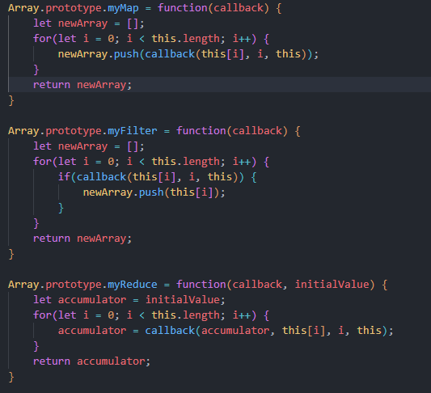

<h1>Difference Between Props and State</h1>

Props and state are used to store and manage component data in React.js.

<b>Props</b> (short for properties) are passed to a component from its parent component and are used to configure the component. Props are read-only, meaning that a component cannot modify its props.

<b>State</b>,  is managed by the component itself and can be changed over time. A component can update its state, which will cause the component to re-render and update the view. State should be used for values that change within a component.

Props are used to pass data down the component tree, and state is used to store and manage data that is local to a component.

<h1>Use State API In React.js</h1>

useState is a Hook in React.js that allows you to add state to functional components. It is a way to add state management to functional components, which do not have access to the lifecycle methods of class components.

The useState function takes an initial value as an argument and returns an array with two elements:

The first element is the current value of the state.
The second element is a function that allows you to update the state.

<h1> How Map, Reduce, Filter Functions work</h1>
<h3>Map</h3>

In React.js, map is a JavaScript array method that can be used to create a new array by applying a certain function to each element of an existing array.

When working with React, map can be used to create a new array of JSX elements that can be rendered in a component.

<h3>Reduce</h3>

reduce is a JavaScript array method that can be used to iterate over an array and reduce it to a single value. The method takes two arguments: a callback function, and an initial value (also called an accumulator).

The callback function is executed for each element in the array and takes two arguments: the accumulator and the current element. The function can update the accumulator and return it to be used in the next iteration.

<h3>Filter </h3>

The filter function in JavaScript is a method that can be used to iterate over an array and create a new array with elements that pass a certain test. The function takes a callback function as an argument, which is executed for each element in the array. If the callback function returns true for a given element, that element is included in the new array. If the callback function returns false, the element is excluded.

<h1>map, filter, reducer methods and attach it to an array using prototype chain</h1>

