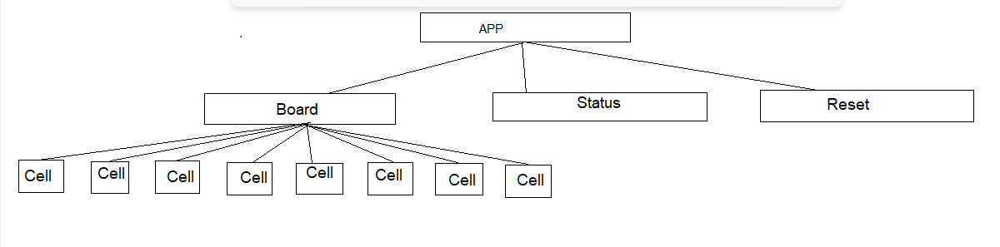

<h1>Tic=Toc Game</h1>

The <b>App component</b> is the top-level component that renders the other components. 
The <b>Board component</b> renders the game board, which is made up of multiple Cell components. 
The <b>Status component</b> displays the game status (e.g. "X's turn" or "O wins!"). 
The <b>Reset component</b> renders the reset button. 
In this hierarchy, the App component would manage the overall state of the game, such as the current player's turn, the game status (win, lose, draw), and the game board.
 
The Board component would manage the state of the individual cells on the game board. Each Cell would receive its own props, such as whether it is an X or O, if it is enabled or disabled, and if the cell is a winning cell or not.
 
The Status component would simply receive the props from the App component and render the status.
 
The Reset component would also receive props from the App component and would have a onClick event that triggers a reset function.
 
To manage state and props, I would use the useState and useEffect hooks to handle the state and props respectively.
 
In this way, the state of the game would be maintained in the App component and passed down to the other components as props. The components that need to change the state, such as the Board component, will receive props and callbacks to update the state in the parent component, the App component.
 
This way, the state and logic of the game would be centralized in the App component and the other components would simply render the state and receive callbacks to update the state.

